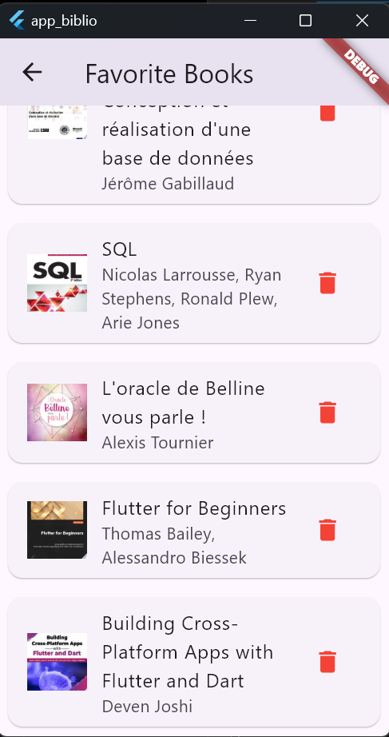

# App Biblio

Une application Flutter de gestion de bibliothèque personnelle qui permet de rechercher des livres via l'API Google Books et de gérer ses favoris.

## Fonctionnalités

- 🔍 **Recherche de livres** : Recherchez des livres en utilisant l'API Google Books
- ❤️ **Gestion des favoris** : Ajoutez et supprimez des livres de vos favoris
- 💾 **Stockage local** : Les favoris sont sauvegardés localement avec SQLite
- 🖼️ **Aperçu des couvertures** : Visualisez les couvertures des livres
- 📱 **Multi-plateforme** : Fonctionne sur Android, iOS, Windows, macOS et Linux

## Prérequis

Avant d'exécuter cette application, assurez-vous d'avoir :

1. **Flutter SDK** installé (version 3.0 ou supérieure)
   - [Guide d'installation Flutter](https://docs.flutter.dev/get-started/install)

2. **Un éditeur de code** (recommandé) :
   - [Visual Studio Code](https://code.visualstudio.com/) avec l'extension Flutter
   - [Android Studio](https://developer.android.com/studio) avec le plugin Flutter

3. **Pour le développement mobile** :
   - **Android** : Android Studio et Android SDK
   - **iOS** : Xcode (macOS uniquement)

4. **Pour le développement desktop** :
   - **Windows** : Visual Studio 2019 ou plus récent
   - **macOS** : Xcode
   - **Linux** : Outils de développement Linux

## Installation et exécution

### 1. Cloner le projet
```bash
git clone <url-du-repo>
cd app_biblio
```

### 2. Installer les dépendances
```bash
flutter pub get
```

### 3. Vérifier la configuration
```bash
flutter doctor
```

### 4. Exécuter l'application

#### Sur mobile (Android/iOS)
```bash
# Connectez votre appareil ou lancez un émulateur
flutter devices

# Exécuter sur Android
flutter run

# Exécuter sur iOS (macOS uniquement)
flutter run -d ios
```

#### Sur desktop

**Windows :**
```bash
flutter run -d windows
```

**macOS :**
```bash
flutter run -d macos
```

**Linux :**
```bash
flutter run -d linux
```

#### Sur web
```bash
flutter run -d chrome
```

### 5. Mode développement

Pour le développement avec hot reload :
```bash
flutter run
```

Puis utilisez :
- `r` pour hot reload
- `R` pour hot restart
- `q` pour quitter

## Structure du projet

```
lib/
├── main.dart                 # Point d'entrée de l'application
├── models/
│   └── book.dart            # Modèle de données pour les livres
├── services/
│   ├── api_service.dart     # Service pour l'API Google Books
│   └── db_service.dart      # Service de base de données SQLite
└── pages/
    ├── search_page.dart     # Page de recherche de livres
    └── favorites_page.dart  # Page des favoris
```

## Dépendances principales

- `http` : Pour les requêtes API
- `sqflite` : Base de données SQLite pour mobile
- `sqflite_common_ffi` : Base de données SQLite pour desktop
- `path` : Gestion des chemins de fichiers

## Résolution des problèmes

### Erreur "databaseFactory not initialized"
Cette erreur a été corrigée dans la version actuelle. L'application détecte automatiquement la plateforme et initialise la base de données appropriée.

### Problèmes de compilation
```bash
# Nettoyer le projet
flutter clean

# Réinstaller les dépendances
flutter pub get

# Relancer
flutter run
```

### Problèmes de permissions (Windows)
Si vous rencontrez des erreurs de permissions sur Windows, exécutez votre terminal en tant qu'administrateur.

## API utilisée

Cette application utilise l'[API Google Books](https://developers.google.com/books/docs/v1/using) pour la recherche de livres. Aucune clé API n'est requise pour les requêtes de base.

## Galerie d'images




## Contribution

Les contributions sont les bienvenues ! N'hésitez pas à ouvrir une issue ou soumettre une pull request.
